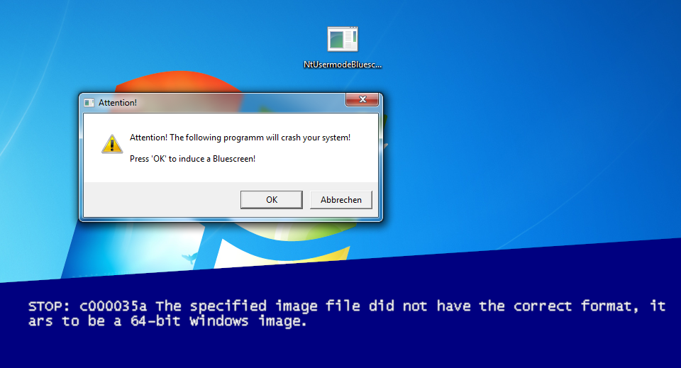

# NtUsermodeBluescreen

This application can trigger a blue screen in all versions of Windows starting from Windows Vista.
Including Windows 7, Windows 8.1 and Windows 10.

No admin elevation or special rights are required. Normal user accounts can also do this.

## How it works

Windows NT kernel drivers can send graphical (error) messages to the user by calling ZwRaiseHardError without having to access the Win32 API. ZwRaiseHardError can also be used to immediately shut down the system with a bluescreen, if e.g. a critical driver error occours.

While playing around with Windows Syscalls, I discovered that, for reasons unknown to me, the user-mode version of this function, NtRaiseHardError, can also trigger bluescreens. This requires the SE_SHUTDOWN_PRIVILEGE privilege, but virtually every user, including guest accounts, has this privilege.

Calling NtRaiseHardError with the OptionShutdownSystem parameter then escalates to a call of KeBugCheckEx by the CSRSS, which triggers a (very bare) bluescreen with a NTSTATUS bugcheck code.

Still confirmed working under Windows 10 20H2 ¯\\\_(ツ)\_/¯